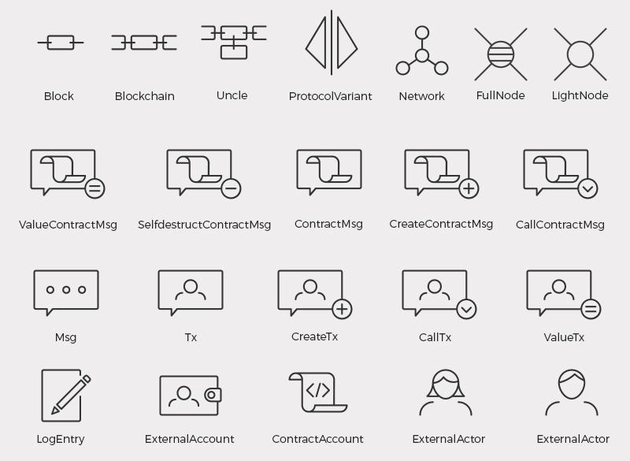

# EthOn Illustrations

## EthOn model of Ethereum (simplified)
Informal and simplified illustration of an Ethereum network and blockchain modeled with EthOn.

## Illustration key
The illustrations basically comply with [VOWL](http://vowl.visualdataweb.org/v2/) for concept illustrations
and [QueryVOWL](http://vowl.visualdataweb.org/queryvowl/v1/index.html) for modeling scheme illustrations.

### Account concept

### Block modeling scheme

### Message, Transaction Receipt and Log concepts

### State Transition concept and modeling scheme

### Network concept and modeling scheme

## EthOn icon set

The above is an excerpt of the icon set. There are some more icons in this folder.

The icons were designed by @VladTod. Thank you!

Like the rest of EthOn they are licensed CC-BY

## Post-processing

### Create png files from the svgs

`find ./ -type f -name "*.svg" -exec inkscape -z -e {}.png -w 512 -h 512 {} \;`

`rename .svg.png .png *.svg.png`

### Cleanup
 - Remove Adobe comment
 - Remove ` style="enable-background:new 0 0 106 106;" xml:space="preserve"`
 - change `id=''` to the full EthOn URI

